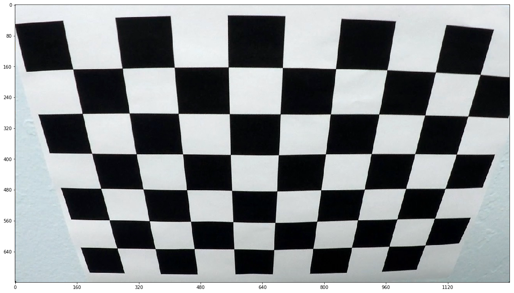
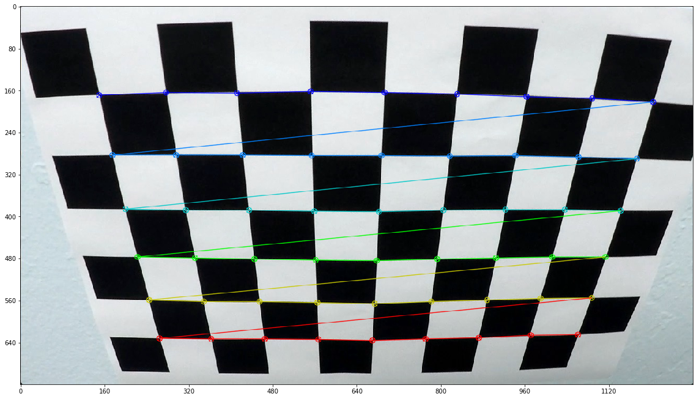
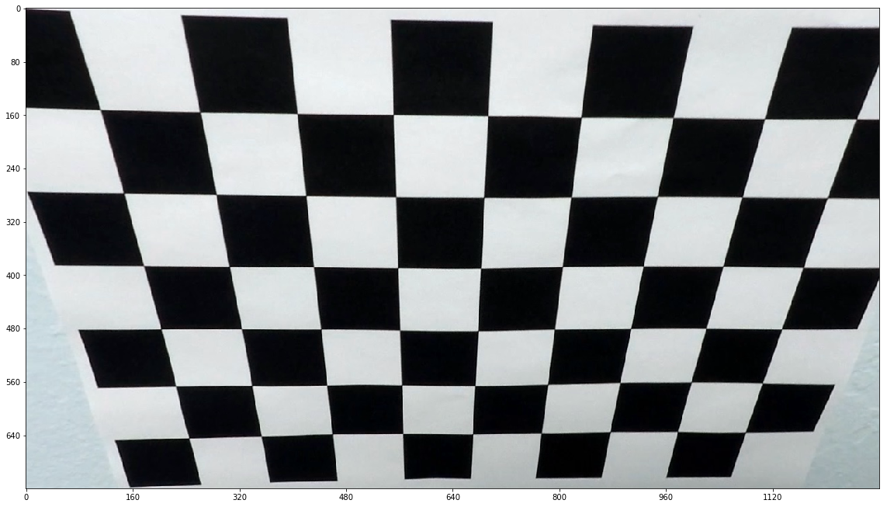
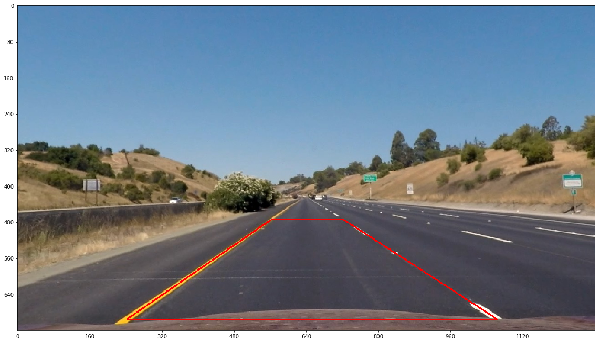
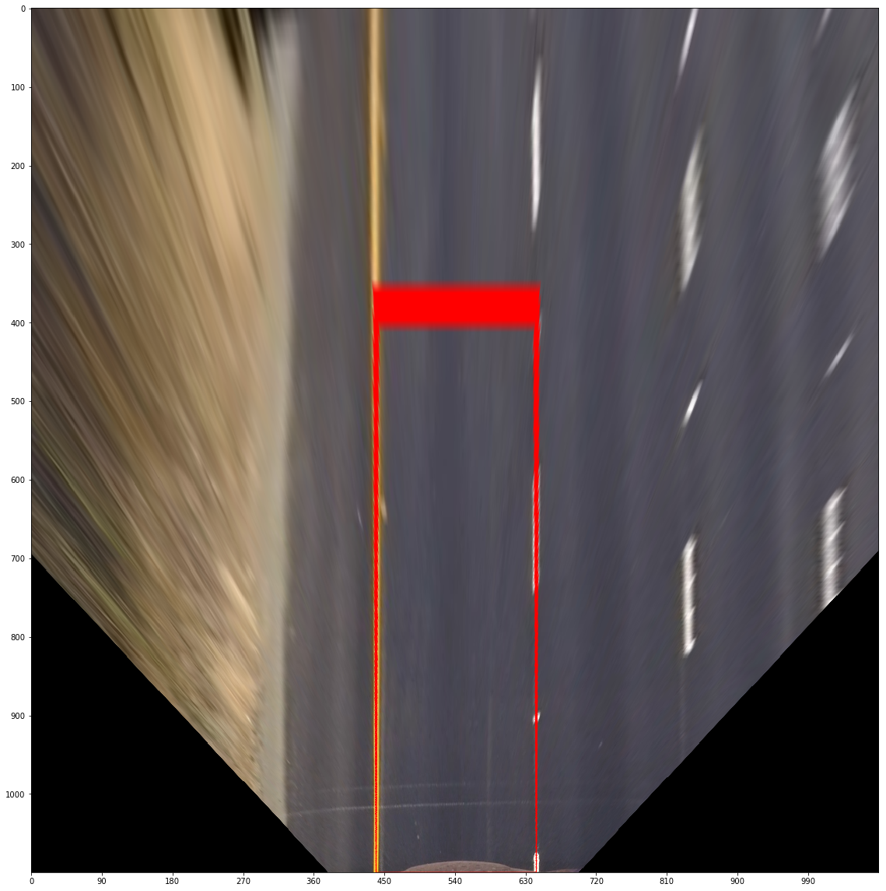

##Lane Tracker

##**This README needs to be cleaned up**

###Camera Calibration

####1. Briefly state how you computed the camera matrix and distortion coefficients. Provide an example of a distortion corrected calibration image.

The code for this step is contained in the the file `camera_calibration.py`).

I start by preparing "object points", which will be the (x, y, z) coordinates of the chessboard corners in the world. Here I am assuming the chessboard is fixed on the (x, y) plane at z=0, such that the object points are the same for each calibration image. Thus, `objp` is just a replicated array of coordinates, and `object_points` will be appended with a copy of it every time I successfully detect all chessboard corners in a test image. `image_points` will be appended with the (x, y) pixel position of each of the corners in the image plane with each successful chessboard detection.

I then used the output `object_points` and `image_points` to compute the camera calibration and distortion coefficients using the `cv2.calibrateCamera()` function. I applied this distortion correction to the test image using the `cv2.undistort()` function. Here is an illustration of the result:

| Original Image | Detected Corners | Distortion-Corrected Image |
|:--------------:|:----------------:|:-----------------:|
|  |  |  |

###Pipeline (single images)

####1. Provide an example of a distortion-corrected image.

An example of a distortion-corrected image is already shown above.

####2. Describe how (and identify where in your code) you performed a perspective transform and provide an example of a transformed image.

From here on out, all line numbers refer to lines in the main code file, `LaneTracker.py`.

My program applies the perspective transform **before** any thresholding and filtering as I found this order yields better results, so I'll briefly describe this part first.

The perspective transform happens simply by `find_lane_points()` calling `cv2.warpPerspective()` in line 776, there is no wrapper or anything. The output size of the warped image is set to (1080,1100). The warped image height of 1100 pixels was chosen to stretch out the warped image vertically in order to straighten the curves a bit, which helps the sliding window search described below perform better, while at the same time including a long enough patch of the road. The warp matrix was hard-coded based on manually chosen source and destination warp points as shown below based on `test_images/straight_lines1.jpg`. Automatic methods that try to find the warp points based on methods involving lines that point toward the image's vanishing point are too fragile and fail for most images, so I didn't pursue this option.

These are the source and destination points used to generate the warp matrices:

| Source        | Destination   |
|:-------------:|:-------------:|
| (242, 695)    | (439, 1100)   |
| (564, 473)    | (439, 380)    |
| (721, 473)    | (643, 380)    |
| (1064, 695)   | (643, 1100)   |

I verified that my perspective transform was working as expected by drawing the source and destination points onto a test image and its warped counterpart to verify that the lines appear parallel in the warped image.

| Original Image | Warped Image |
|:--------------:|:----------------:|
|  |  |

####3. Describe how (and identify where in your code) you used color transforms, gradients or other methods to create a thresholded binary image.  Provide an example of a binary image result.

The function that does all the color space conversion, filtering, morphing and color thresholding is the method `filter_lane_points()` of the class `LaneTracker` in lines 147-204 of `LaneTracker.py`.

The method applies two color space conversions: The R-channel of the RGB color space is used to filter white lines and bright things in general and the B-channel of the LAB color space is used to filter yellow lines. I compared all channels of the RGB, HLS, HSV, and LAB color spaces on a number of test images and found that the LAB B-channel is by far the superior and lowest noise identifier of yellow lane lines, while rhe RGB R-channel was on all test images superior or on par with all other channels for detecting white lane lines.

Next, a tophat transform (`cv2.morphologyEx()`) is applied to both isolated color channels to filter shapes that are brighter than their surroundings. In addition to keeping only shapes that are brighter than their surroundings, the tophat transform also keeps only shapes that fit inside the kernel (although this is a bit of an imprecise explanation), so large bright objects are also filtered out.

Next, and most importantly, a color threshold is applied to both isolated color channels separately. Now it should be obvious that a global fixed threshold wouldn't do a good job here because the colors and the lighting conditions in the images (and along with them, the pixel value intensities) vary. In one image, all white lines might have an RGB R-channel intensity of greater than 170 because the sun is shining, but in another image, they might have intensity values of as low as 120 because it is dusk or the lines are in the shade. Similarly, if the pavement or any irrelevant objects are very bright, they might also pass your global threshold intensity even though they are not supposed to. Regardless of how you choose a global threshold, in many images you're inevitably going to either eliminate the lane line pixels you want because the lines are too dark, or to keep a lot of noise because you set the threshold too low. Even if the global threshold were adaptive it would suffer from similar problems because the average pixel intensity across an entire image doesn't mean much - the sky in the image could be super bright, pushing up the average, and the lane lines could still be very dark.

An local adaptive threshold as it is used in `filter_lane_points()` is the better way to go. Depending on the `filter_mode` argument, the method uses either OpenCV's `cv2.adaptiveThreshold()` or my own `bilateral_adaptive_threshold()` (I wasn't able to come up with a better name), which is defined in lines 42-81 of `LaneTracker.py`. The program makes use of both thresholding functions (and I will explain why below), but in the vast majority of all cases it uses the much more important `bilateral_adaptive_threshold()`. I wrote this function because a simple adaptive thresholding function like `cv2.adaptiveThreshold()` does not fit our needs for this problem. Here is why:

With a simple adaptive thresholding function like `cv2.adaptiveThreshold()`, a given pixel passes the threshold if it has a higher intensity value than the average (or some weighted average) of its surrounding pixels (possibly plus some additive constant). While this is useful to filter bright lane lines, unfortunately it also keeps the contours of any large bright areas in the image that are surrounded by darker areas, and so a lot of noise will pass the threshold. This is because it doesn't matter to the threshold whether a pixel is brighter than the surrounding pixels in both half-planes around it or whether it is only brighter than the surrounding pixels in one half-plane but not in the other.

In contrast, the bilateral adaptive threshold function that I wrote uses a cross-shaped kernel of 1 pixel thickness that, for a given pixel, computes the average intensities of the left, right, upper, and lower parts of the cross **separately**. In order to pass the threshold, a given pixel is required to be brighter than either both the left and right averages or both the top and bottom averages. Let me illustrate the implications this has:

Here is an example image and its warped version:

| Original Image | Warped Image |
|:--------------:|:----------------:|
|  |  |

Now here are two thresholded versions of the warped image above, one using my bilateral adaptive threshold function and the other one using OpenCV's `cv2.adaptiveThreshold()`, both applied to the raw warped color channels with no prior tophat morphology (I'll talk about that below):

| cv2.adaptiveThreshold | bilateral_adaptive_threshold() |
|:--------------:|:----------------:|
|  |  |

The lane lines are clearly visible in both binaries, but there is more noise in the left image. You can see a strong line left of the left lane line in the left image. Why is it there in the left image, but not in the right one? The sharp shadow cast by the guardrail causes the pixels right of it to be brighter than their overall average neighborhood, and so they pass the threshold in `cv2.adaptiveThreshold()`. In `bilateral_adaptive_threshold()` they don't pass the threshold, because the pixels are only brighter than what's on the left of them, but not what's on the right of them. For the same reason you can see white pixels in the left image at the points where the pavement suddenly turns from dark to light gray, and at the points where the black car is surrounded by light pavement. Most of this noise isn't there in the right image.

That's not the whole story though. If you apply a tophat morphology before the threshold, it makes the results with `cv2.adaptiveThreshold()` a lot better than without, because the tophat morphology already eliminates many bright shapes that are too large or shapes that aren't brighter than two sides of their neighborhood. So it's totally possible to get similar results with `cv2.adaptiveThreshold()` + tophat as you can with `bilateral_adaptive_threshold()`, but when I compared the results I found that the bilateral threshold still works a little better.

`filter_lane_points()` still uses `cv2.adaptiveThreshold()` **without** a prior tophat morphology in some cases though. Why is that? Consider a case where the lane lines aren't visible. They might be covered by foliage as in the harder challenge video, they might simply not be there, or whatever else could happen. If, however, there still happens to be a clear-cut intensity contrast between the lane pavement and the side of the road, then `cv2.adaptiveThreshold()` has a much higher chance of finding such a line than `bilateral_adaptive_threshold()`, because this time we're not looking for a lane line where both sides of the line are darker than the line itself. This time it's good enough for us if one side of the line is brighter than the other (e.g. the foliage is brighter than the road pavement). My program therefore tries this as a second attempt, a fallback, whenever it wasn't able to find lane lines with `bilateral_adaptive_threshold()` at the first attempt.

`filter_lane_points()` also has a `mask_noise` feature defined in lines 185-199. This feature uses the LAB B-channel in an additional stage to filter out background noise in the image. It is mostly targeted at greenery. This masking stage is activated by default, but it is deactivated when `cv2.adaptiveThreshold()` is used so that said foliage from the example above doesn't get eliminated from the image if we need it. This noise mask, using the LAB B-channel, is not only pretty effective at eliminating greenery (under appropriate lighting conditions), but unfortunately it also eliminates the yellow lane line. Therefore, in line 189, we just bring the yellow lane line back to create the final noise mask.

The two measures described in the previous two paragraphs are in large part responsible for program's ability to find the lane lines in most frames of the harder challenge video.

The last step in `filter_lane_points()` is to apply an open morphology to the binary image. The open morphology first erodes the white pixel shapes by the kernel size and then dilates what remains left, resulting in the elimination of smaller noise parts in the image. This improves the robustness of the thresholding quite a bit.

####4. Describe how (and identify where in your code) you identified lane-line pixels and fit their positions with a polynomial?

The methods `sliding_window_search()` (lines 206-411) and `band_search()` (lines 413-464) identify lane line pixels in the binary image that is the output of `filter_lane_points()`, `fit_poly()` (lines 466-473) fits a 2nd-degree polynomial to the indentified lane line pixels, and `get_poly_points()` (lines 475-492) computes the graph points of a 2nd-degree polynomial given its coefficients.

`sliding_window_search()` is the search method used whenever we have no existing fitted lane line polynomials from recent previous images. It scans the image from the bottom to the top using rectangular search windows that are convolved with the image. Each successive search window covers only a certain range around the horizontal center of its preceding search window. Of course the width and height of the search windows and the search range (how far to the left and right of the previous window center to search) largely determine the performance of `sliding_window_search()`, but one property that improves its behavior quite a bit is that if one side (left or right) doesn't find any pixels in a given iteration, then it moves in the same direction as the other side, unless the other side didn't find any pixels either. This approach works a lot better than just keeping the horizontal window center constant from one iteration to the next in case no pixels are found.

`band_search()` is the search method used whenever we do have existing fitted lane line polynomials from recent previous images. It searches for lane line pixels in a narrow band of a specified width around the previous polynomial graph. Since the images in a video sequence are intercorrelated by the fact that the change of the lane lines over the sequence is continuous (in the mathematical sense), this band search approach allows for a much more robust search method and is used whenever possible.

Here is an example from the harder challenge video to visualize these two search processes. The left image is our first frame of the sequence and uses the sliding window search, the right image is our second frame and uses the two polynomials found in the first frame to perform a band search. The search area is highlighted in green, the detected lane pixels are highlighted in blue and red, and the resulting fitted polynomial graphs are shown in yellow.

| First Frame Result | Second Frame Result |
|:--------------:|:----------------:|
|  |  |
| First Frame: Sliding Window Search | Second Frame: Band Search |
|  |  |

####5. Describe how (and identify where in your code) you calculated the radius of curvature of the lane and the position of the vehicle with respect to center.

`get_curve_radius()` (lines 494-513) computes the curve radius and `get_eccentricity()` (lines 515-523) computes the car's distance from the center of the lane. The computation of the eccentricity is straight forward and uses conversion factors for meters per pixel that were calculated based on the warped images. The computation of the curve radius happens according to the formula [here](http://www.intmath.com/applications-differentiation/8-radius-curvature.php) using the same metric conversion factors and the y-value at which the curve radius is computed is the bottom of the image.

####6. Provide an example image of your result plotted back down onto the road such that the lane area is identified clearly.

An example image of the result is already provided above in section 4.

---

###Pipeline (video)

####1. Provide a link to your final video output. Your pipeline should perform reasonably well on the entire project video (wobbly lines are ok but no catastrophic failures that would cause the car to drive off the road!).

Here are the links to the processed video files:

1. [project video](https://www.youtube.com/watch?v=LyMyVjPRIS0)
2. [challenge video](https://www.youtube.com/watch?v=G72F7Y3f3ZY)
3. [harder challenge video](https://www.youtube.com/watch?v=mRithgcjeS8)

---

###Discussion

####1. Briefly discuss any problems / issues you faced in your implementation of this project.  Where will your pipeline likely fail?  What could you do to make it more robust?

One insight of my experiments was that, for this particular problem, color thresholding works a lot better than gradient thresholding and the program is more robust without applying any gradient thresholding at all. The objects we're trying to detect here (lane line segments) have relatively simple structure (compared to detecting cars, for example) and are clearly defined by just color and size (we're looking only for shades of white and yellow of a certain minimum thickness/diameter that start close to the bottom of the image) and by the fact that they are brighter than their surrounding pixels. These properties of the objects of interest allow us to get very good results using just color thresholding (and some morphologies, but not gradients). In my experiments, color thresholding accounted for the vast majority of the exposed lane line pixels, while gradient thresholding added little value on top of that, but instead contributed the majority of the noise in the filtered image. Using a bilateral adaptive color threshold as I did here has a similar effect as using a gradient threshold, only better.

In order to achieve decent performance on the harder challenge video I found it necessary to implement a filter to elminate greenery as an additional stage in `filter_lane_points()`. Notably, the LAB B-channel by itself is enough to filter out greenery very effectively without removing lane line pixels if the thresholds are set appropriately.

One big problem that becomes apparent in the harder challenge video is the changing slope of the road. The warp matrix that is used for the perspective transform is static and assumes that the road ahead is flat. If that assumption does not hold, lines that should be parallel in the warped image will no longer be parallel. This makes it a lot harder to assess the validity of detected lane lines, because even if the lane lines in the warped image are not nearly parallel, they might still very well be valid lane lines. In order to account for this, I had to drastically relax the criteria that assess lane line validity in `check_validity()` (lines 525-591), otherwise the program would reject too many valid lane lines. On the other hand though, this relaxation of the validity criteria also leads to some detections passing for valid lane lines even though they should have been rejected. The only solution to this porblem is to use dynamic warp matrices that reflect the slope of the road in the respective image so that we can be sure that parallel lines actually appear parallel in the warped images and thus stricter validity criteria can be applied reliably. If you have any hints on how to improve on the static warp matrices used here, I'd love to here them.

This project made me realize how hard computer vision is. I can't imagine that lane detection systems used in practice rely solely on camera image information, it should be much more robust to use RADAR or LIDAR in conjunction.
